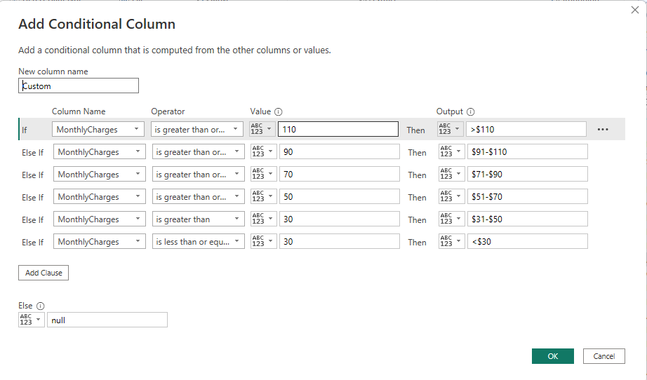
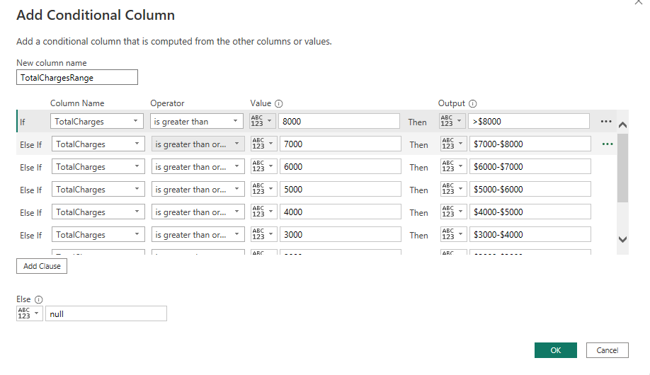
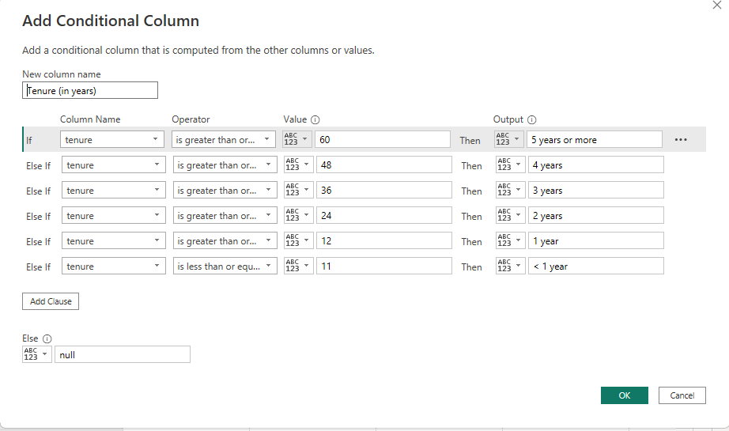
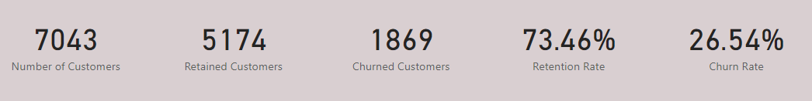
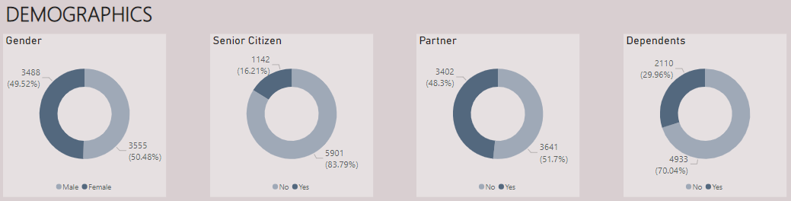
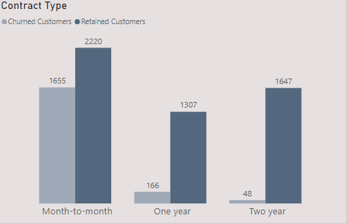
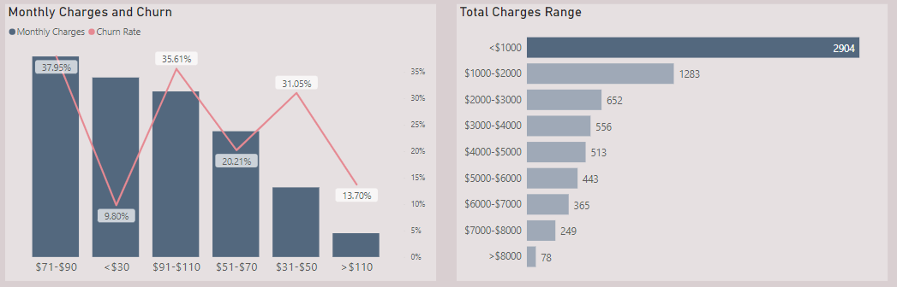
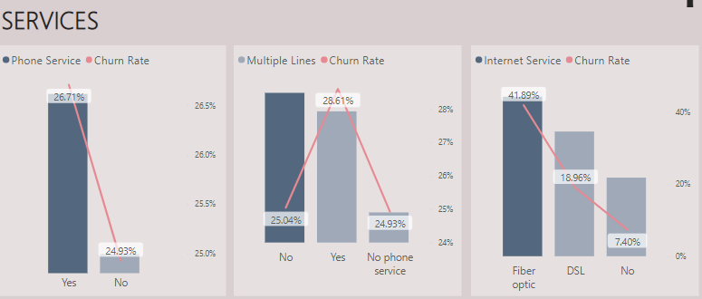
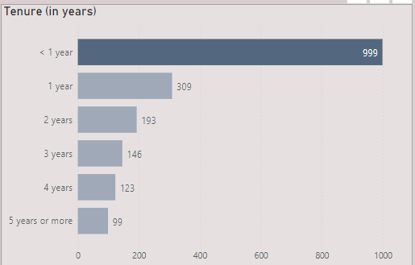

# Power_BI_Virtual_Case_Experience__Task_2   

## Context;    
This is the second task in the Virtual case experience with PwC. I’ll be reporting to the retention manager of PwC about customer retention in PhoneNow.   
Refer to PwC Switzerland Power BI Virtual Case Experience Task 1 for [more context](https://github.com/graceidiare/PowerBI_Virtual_Case-Experience__Task_1)   

### Task;   
1.	Define proper KPIs   
2.	Create a dashboard for the retention manager reflecting the KPIs     
3.	Write a short email to him (the engagement partner) explaining your findings, and include suggestions as to what needs to be changed    

_The dataset contains 26 columns and 7043 rows. Each row contains a customer’s demographic information, account information and services they have signed up for_.   

### Data Cleaning/Transformation;   

The data cleaning required was not tedious as it was only the total charges column that had nulls which I replaced with 0(only 11 rows recorded were like that).    
The monthly and total charges columns were changed to the fixed decimal number (i.e the currency data type).    
I replaced the 0s and 1s in the senior citizen column to No and Yes respectively.      
I wanted to find out the way how the customers were grouped according to the monthly and total charges they paid. I created a conditional column grouping the aforementioned columns as shown below.      

MonthlyCharges                     |       TotalCharges
:---------------------------------:|-------------------------------
            |            

Tenure, recorded in months which represents how long the customer had used PhoneNow’s services was also grouped into 6 different year buckets; less than 1 year, 1 year, 2 years, 3 years, 4 years and 5 years or more.    

Tenure(in years)|   
:---------------:

_There was no data modelling process required._   

### Analysis and Visualization;    

First, I defined the following KPIs that will be used to measure customer retention and churn;   

1.	Retained Customers and retention rate    
2.	Churned Customers and churn rate     
3.	Demographic factors such as age, senior citizen or not? Has a partner or not? Has a dependent or not?    
4.	Contract type, payment type etc.    
5.	Services signed up for etc.      

To get an overview of the dataset, I calculated for the total customers, retained customers, churned customers, retention rate and churn rate using measures.     

As shown, the total number of customers as shown on the dashboard is 7,043. Out of which, 1869 are no longer customers. This indicates a 26.54% churn rate (industry standard is 31%). Retention is at a rate of 73.46%, which is quite laudable. While the churn rate is not skyrocket high, the team can take proactive measures can be taken to reduce it.    

PhoneNow is populated by both male and female customers, but there are fewer senior citizens and those without dependents.    

Customer account information such as contract type, payment type, monthly charges, total charges shows that a large part of the customers sign up for the month-to-month contract. It is interesting to see that more customers sign up for a two-year contract than a one-year contract.      

Most customers pay monthly charges between $71 and $90 and total charges less than $1000. This is a slightly higher contrast of the $64.76 monthly average. But the same cannot be said about the total charges average of $2279.73. Almost 3000 customers have paid less than $1000 collectively.     

Paperless billing which is known to enable quicker payments could have affected the payment of charges. This should be addressed.     
Total Charges, which can be represented as Revenue is at $16.06M. This figure cannot be compared with time as there is no time variable.    

The services a customer signs up for can have a significant impact on their retention and churn rate.     

Those who sign up for Phone Service have a 26.71% churn, a small difference from who don't. PhoneNow offers three (3) types of internet service with most customers using the Fiber Optic service. Unlike DSL, those who use the Fibre Optic service churn faster. Customers with multiple lines churn a little faster. But this is not a clear metric as the three (3) categories (Yes, No, and No Phone service) almost churn at the same rate. Also, those who don't use phone service also don't have multiple lines hence the recurring 24.93%.          

Streaming Movies and Streaming TV are strongly correlated, customers who sign up for Movies are also likely sign up for TV. Those who do not use the both services have a higher churn rate. Still, the difference between both choices aren't far apart. However, signing up for tech support has more noticeable impact on churn. Signing up for Online Security and Online backup affects churn. This is also noticed in device protection.       

  

Most customers have been using this service for less than 10 months i.e less than a year. The churn rate reduces as customers continue using the services PhoneNow provides.    

### Recommendations (_Email draft_);   

As explained by the retention manager, customers in the telecom industry are hard-earned. This means increasing the retention rate while decreasing the churn rate should be major focus. Below are some of my recommended suggestions;   

1. Offer discounts for those who subscribe for either one year or two year.     
2. Customers should be encouraged to use Credit Card when making payments.      
3. Adopt a non-paperless billing policy for convenience and faster payment.     
4. Review pricing policies and structure.      
5. Sensitize customers on the benefits of using internet service because services like streaming movies, streaming tv, tech support, device protection, online security and online backup depends on whether the customer uses internet service or not.    

